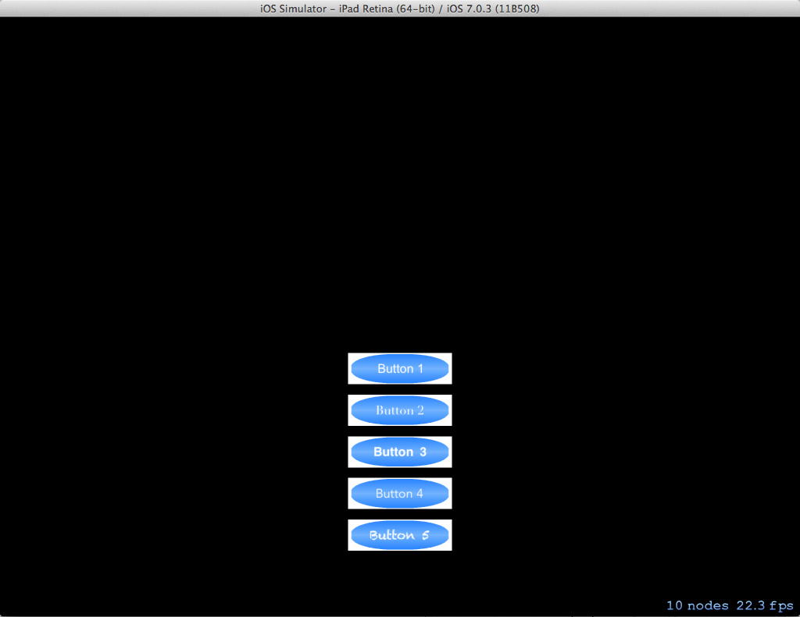
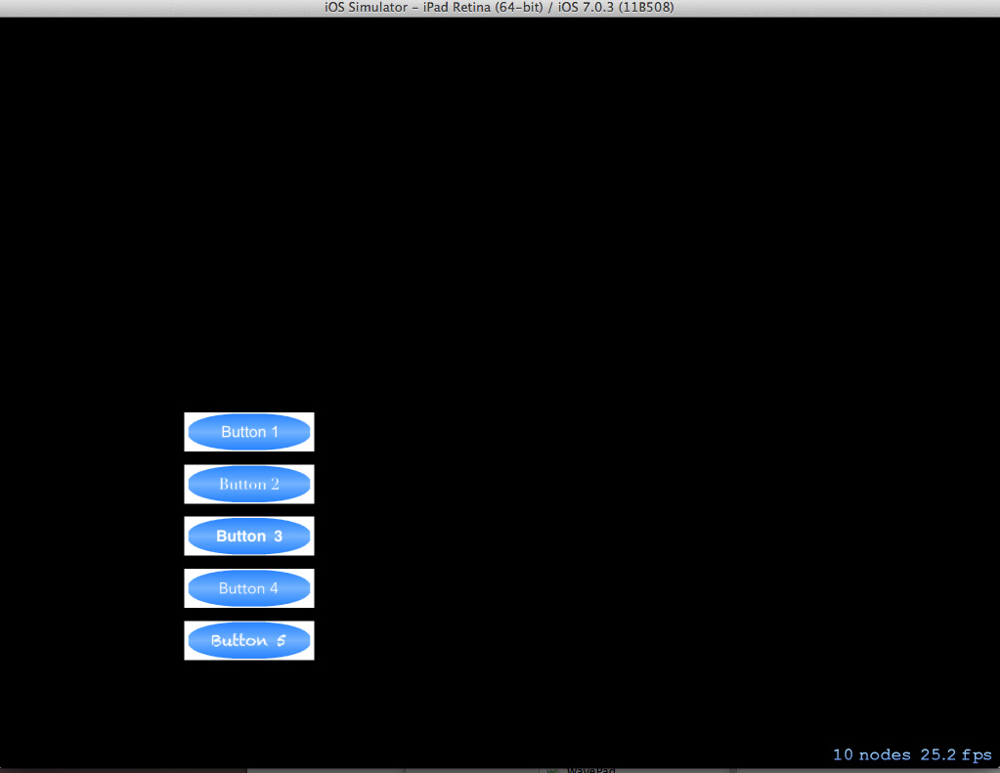
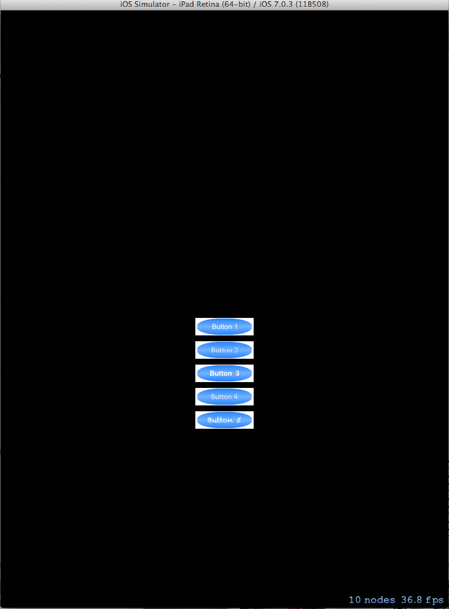
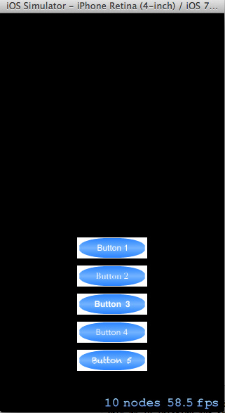
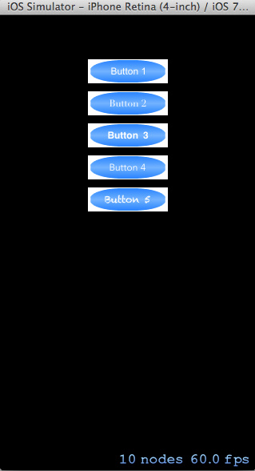

SpriteKitButton
===============

Simple Sprite Kit Button Class

This project attempts to provide an easy-to-use class for adding text buttons to a sprite kit scene.

If a text button is not explicitly positioned on the scene, it will be placed sequentially from top to
bottom in the order they are created - pending any other explicitly positioned buttons.
Padding can be specified to give more spacing between buttons.

TODO: 
Ensure buttons are not cut-off for various start positions.
Add horizontal positioning of buttons.
Find better images to use for button textures and incorparte some examples of using the centerRect property.

